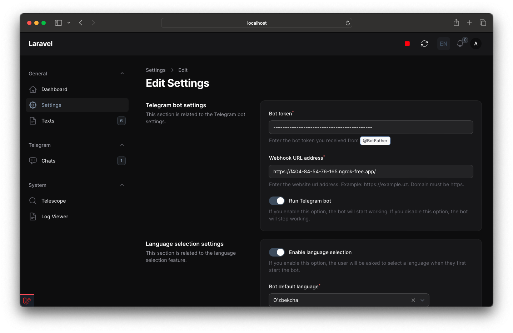

<p align="center"></p>

### Used technologies
<div style="display: flex;align-items: center; justify-content: space-between">
    <a href="https://nutgram.dev"></a>
    <a href="https://filamentphp.com"></a>
    <a href="https://laravel.com"></a>
</div>

## About Laravel Telegram Starter Kit
Laravel Telegram Starter Kit is a starter kit for Laravel with Telegram Bot API integration. It is a simple and easy to use starter kit with beautiful admin panel for Telegram Bot API integration with Laravel.


### How to use?
1. Clone the repository or create repository from this template
2. Run
```bash
composer install
```
```bash
npm install
npm run dev
```
3. Run migrations with seeders
```bash
php artisan migrate --seed
```
4. Run the server
```bash
php artisan serve
```
5. Open `/admin` route in your browser and login with credentials. Default credentials are:
```
Email: admin@admin.com
Password: admin12345
```
